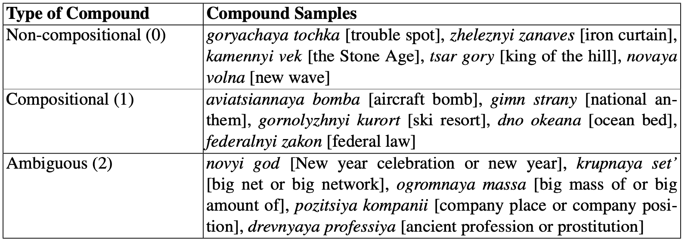

# Noun Compositionality Detection Using Distributional Semantics for the Russian Language

This repository contains code and data related to the paper on noun compositionality experiments for the Russian language:

*Puzyrev D., Shelmanov A., Panchenko A., Artemova E. (2019): [Noun Compositionality Detection Using Distributional Semantics for the Russian Language](https://link.springer.com/chapter/10.1007/978-3-030-37334-4_20 ). In Proceedings of the 8-th International Conference on Analysis of Images, Social Networks and Texts. Kazan, Russia. Springer Lecture Notes in Computer Science.*

A shorter version of this paper was earlier also presented at 

*Puzyrev, D., Shelmanov, A., Panchenko, A. and Artemova, E., (2019): [A Dataset for Noun Compositionality Detection for a Slavic Language](https://www.aclweb.org/anthology/W19-3708/). In Proceedings of the 7th Workshop on Balto-Slavic Natural Language Processing (pp. 56-62). Italy, Florence. Association for Computational Linguistics.

In this papers, we present the first gold-standard corpus of Russian noun compounds annotated with compositionality information. We used Universal Dependency treebanks to collect noun compounds according to part of speech patterns, such as ADJ-NOUN or NOUN-NOUN and annotated them according to the following schema: a phrase can be either compositional, non-compositional, or ambiguous (i.e., depending on the context it can be interpreted both as compositional or non-compositional). Next, we conduct a series of experiments to evaluate both unsupervised and supervised methods for predicting compositionality. To expand this manually annotated dataset with more non-compositional compounds and streamline the annotation process we use active learning. We show that not only the methods, previously proposed for English, are easily adapted for Russian, but also can be exploited in active learning paradigm, that increases the efficiency of the annotation process.

Examples of compositional (1), non-compositional (0),  and ambiguous (2) compounds are presented below:



The number of compositional and non-compositional compounds in our dataset is presented below:


Examples of compounds and their contexts are presented below. In this example, *atom vodoroda* [hydrogen atom] is compositional (1), *novyi god* [New year celebration or new year] is ambiguous (2), and *vtoroyi eshelon* [second tier] is non-compositional (0).


To refer to the dataset please use the following citations: 

full version: 

```
@InProceedings{10.1007/978-3-030-37334-4_20,
  author="Puzyrev, Dmitry and Shelmanov, Artem and Panchenko, Alexander and Artemova, Ekaterina",
  editor="van der Aalst, Wil M. P. and Batagelj, Vladimir and Ignatov, Dmitry I. and Khachay, Michael and Kuskova, Valentina and Kutuzov, Andrey and Kuznetsov, Sergei O. and Lomazova, Irina A. and Loukachevitch, Natalia and Napoli, Amedeo and Pardalos, Panos M. and Pelillo, Marcello and Savchenko, Andrey V. and Tutubalina, Elena",
  title="Noun Compositionality Detection Using Distributional Semantics for the Russian Language",
  booktitle="Analysis of Images, Social Networks and Texts",
  year="2019",
  publisher="Springer International Publishing",
  address="Cham",
  pages="218--229",
  isbn="978-3-030-37334-4"
}
```

short version:

```
@inproceedings{puzyrev-etal-2019-dataset,
    title = "A Dataset for Noun Compositionality Detection for a {S}lavic Language",
    author = "Puzyrev, Dmitry  and Shelmanov, Artem  and
      Panchenko, Alexander  and Artemova, Ekaterina",
    booktitle = "Proceedings of the 7th Workshop on Balto-Slavic Natural Language Processing",
    month = aug,
    year = "2019",
    address = "Florence, Italy",
    publisher = "Association for Computational Linguistics",
    url = "https://www.aclweb.org/anthology/W19-3708",
    doi = "10.18653/v1/W19-3708",
    pages = "56--62",
}
```
